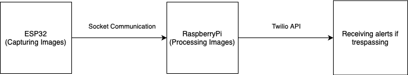
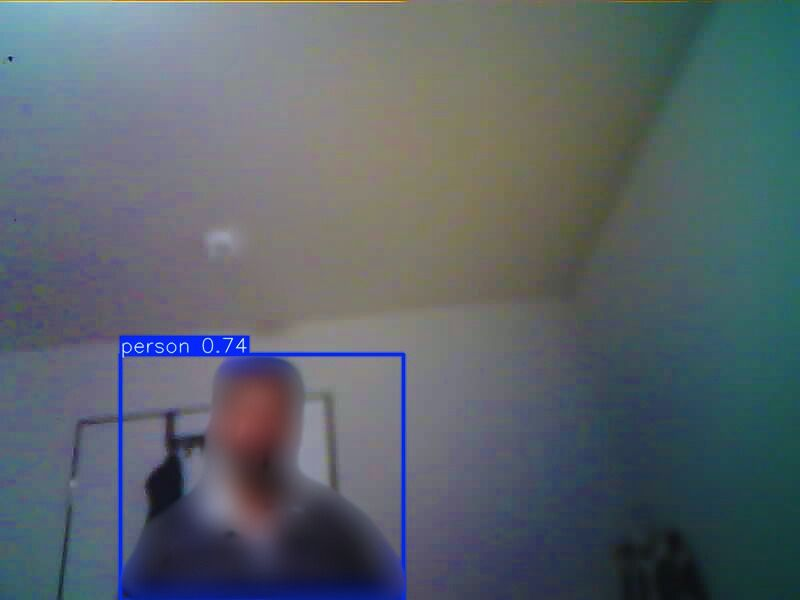
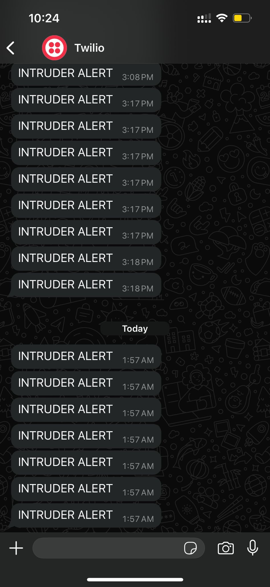

# TinyML-Based-Surveillance-System

A surveillance system was developed using ESP32 and Raspberry Pi to alert the user if someone is trespassing. 

 
ESP32-S3-WROOM was used to take continuous images using the ESPCamera and send the images to Raspberry Pi using socket communication.  

Raspberrypi acts as a server and receive the images the run the inference using a custom trained tflite YOLOv11 model and if a person is detected then using the Twilio API the user receives an alert on whatsapp that someone has trespassed.

